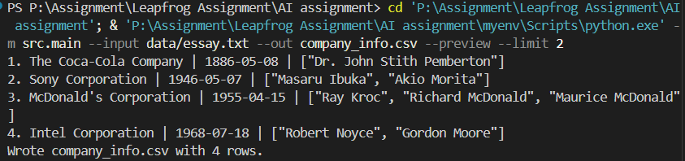

# Intelligent Agent: Company Info Extractor (LCEL + Gemini)

This project extracts structured company information from an essay, paragraph-by-paragraph, using LangChain’s LCEL. It normalizes founding dates, then writes a CSV named `company_info.csv`. A lightweight, rate-limit-friendly setup is included for Gemini API.



## Features

- Paragraph-wise extraction via LCEL
- Fields: company_name, founding_date (YYYY-MM-DD), founders (list)
- Partial date normalization: `YYYY` → `YYYY-01-01`, `YYYY-MM` → `YYYY-MM-01`
- CSV output with columns: `S.N., Company Name, Founded in, Founded by`
- Optional preview printing

## Requirements

- Python 3.12+
- Gemini API key: set one of `GEMINI_API_KEY` or `GOOGLE_API_KEY`

## Quickstart (Windows PowerShell)

1. Create/activate a virtual environment (optional if you already have `myenv/`):

```powershell
python -m venv .venv
.\.venv\Scripts\Activate
```

2. Install dependencies:

```powershell
pip install -r requirements.txt
```

3. Set your API key (or put it in a `.env` file at project root):

```powershell
# Either variable works; pick one
$env:GEMINI_API_KEY = "YOUR_KEY_HERE"
# or
$env:GOOGLE_API_KEY = "YOUR_KEY_HERE"
```

4. Run a tiny test (limits paragraphs to avoid free-tier rate limits):

```powershell
python -m src.main --input data/essay.txt --out company_info.csv --preview --limit 2
```

5. Full run:

```powershell
python -m src.main --input data/essay.txt --out company_info.csv --preview
```

Notes:

- Default model is `gemini-1.5-flash` for lower quota usage. Override with:

```powershell
$env:GENAI_MODEL = "gemini-1.5-pro"
```

- `.env` is auto-loaded (via `python-dotenv`). Example `.env`:

```
GEMINI_API_KEY=your-key
```

## Output

- CSV: `company_info.csv`
  - Example row format:
    - `1,Microsoft Corporation,1975-04-04,"['Bill Gates']"`
- Database (optional wiring present): `companies.db`

## Project Layout

- `src/schemas.py` – Pydantic models + date normalization
- `src/extraction.py` – LCEL chain and sequential runner
- `src/main.py` – CLI entrypoint to produce CSV
- `src/tools.py` – CSV and SQLite tools (agentic optional)
- `data/essay.txt` – Input essay


## Troubleshooting

- 401/permission errors: ensure `GEMINI_API_KEY` or `GOOGLE_API_KEY` is set and valid.
- 429 quota errors: use `--limit`, wait and retry, or switch to `gemini-1.5-flash`.
- Encoding issues: ensure `data/essay.txt` is UTF-8.
